<div align="center">


<h1>Monitoring Cost Frugal</h1>

<p><strong>The Institutional-Grade Platform for Cost-Optimized Observability, Data Frugality, and SRE FinOps Orchestration.</strong></p>

[]()
[]()
[]()

<br/>

> **"Observability is data; Frugality is intelligence."** 
> **Monitoring Cost Frugal** is an enterprise-grade platform designed to provide a secure, measurable, and highly automated foundation for global telemetry economics. It orchestrates the complex lifecycle of observability data—from high-throughput log sampling and cardinality reduction to multi-tier storage lifecycle management and unified SRE FinOps governance.

</div>

---

## 🏛️ Executive Summary

Exploding telemetry volumes and invisible monitoring expenses are strategic operational liabilities; lack of centralized telemetry frugality is a primary barrier to organizational SRE efficiency. Organizations fail to maintain a lean observability budget not because of a lack of dashboards, but because of fragmented data standards, lack of automated sampling, and an inability to orchestrate telemetry economics with operational precision.

This platform provides the **Observability Economics Plane**. It implements a complete **Enterprise Frugality-as-Code Framework**, enabling SRE and Finance teams to manage telemetry spend as a first-class citizen. By automating the reduction of high-cardinality metrics and orchestrating real-time log sampling, we ensure that every organizational signal—from edge network logs to backend trace spans—is cost-optimized by default, audited for history, and strictly aligned with institutional FinOps frameworks.

---

## 📐 Architecture Storytelling: Principal Reference Models

### 1. Principal Architecture: Global Monitoring Cost & Telemetry Frugality Intelligence Plane
This diagram illustrates the end-to-end flow from high-volume telemetry capture and sampling to cardinality reduction, multi-tier storage, and institutional forensic auditing.

```mermaid
graph LR
    %% Subgraph Definitions
    subgraph TelemetryIngress["Telemetry & Signal Ingress"]
        direction TB
        Logs["High-Volume Logs (Loki)"]
        Metrics["High-Cardinality Metrics (Prom)"]
        Traces["Distributed Traces (Tempo)"]
    end

    subgraph IntelligenceEngine["Frugality Intelligence Hub"]
        direction TB
        API["FastAPI Frugality Gateway"]
        Sampler["Smart Sampling Engine"]
        Reducer["Cardinality Reducer"]
        TieringOrch["Storage Tiering Orchestrator"]
    end

    subgraph StorageMesh["Multi-Tier Storage Mesh"]
        direction TB
        HotStorage["Hot Tier (SSD/NVMe)"]
        WarmStorage["Warm Tier (Object S3)"]
        ColdStorage["Cold Tier (Archive/Glacier)"]
    end

    subgraph OperationsHub["Institutional Frugality Hub"]
        direction TB
        Scorecard["Frugality Maturity Score"]
        Analytics["Signal-to-Noise & ROI Stats"]
        Audit["Forensic Telemetry Metadata Lake"]
    end

    subgraph DevOps["Frugality-as-Code Orchestration"]
        direction TB
        TF["Terraform Frugality Modules"]
        Policy["Telemetry Retention Policy"]
        ChatOps["Sampling Approval Hub"]
    end

    %% Flow Arrows
    TelemetryIngress -->|1. Capture Signal| API
    API -->|2. Apply Sampling| Sampler
    Sampler -->|3. Reduce Cardinality| Reducer
    Reducer -->|4. Orchestrate Tiering| TieringOrch
    
    TieringOrch -->|5. Store Data| StorageMesh
    StorageMesh -->|6. Notify Status| ChatOps
    API -->|7. Visualize Health| Scorecard
    
    Scorecard -->|8. Track Spend| Analytics
    Scorecard -->|9. Record Event| Audit
    
    TF -->|10. Provision Hub| IntelligenceEngine
    Policy -->|11. Enforce Retention| TieringOrch
    Audit -->|12. Improve Models| Sampler

    %% Styling
    classDef ingress fill:#f5f5f5,stroke:#616161,stroke-width:2px;
    classDef intel fill:#fff8e1,stroke:#ff8f00,stroke-width:2px;
    classDef storage fill:#e1f5fe,stroke:#01579b,stroke-width:2px;
    classDef ops fill:#ede7f6,stroke:#311b92,stroke-width:2px;
    classDef devops fill:#e8f5e9,stroke:#1b5e20,stroke-width:2px;

    class TelemetryIngress ingress;
    class IntelligenceEngine intel;
    class StorageMesh storage;
    class OperationsHub ops;
    class DevOps devops;
```

### 2. The Telemetry Lifecycle Flow
The continuous path of a telemetry signal from initial capture and sampling to active filtering, tiered storage, and institutional forensic auditing.

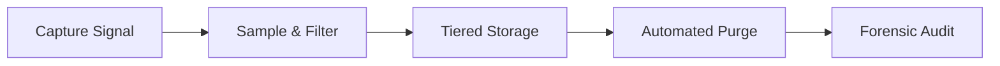

### 3. High-Throughput Log Sampling & Dropping Flow
Strategically eliminating verbose noise (e.g., DEBUG/INFO logs for healthy services) at the ingestion edge, ensuring only high-value forensic signals reach expensive hot storage.

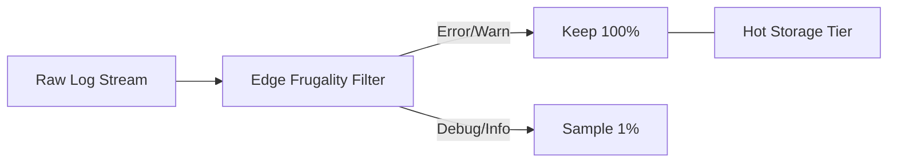

### 4. Metric Cardinality Optimization Flow
Identifying and pruning unused or high-cardinality label sets (e.g., unique user IDs in Prometheus metrics) that exponentially drive up storage and query costs.

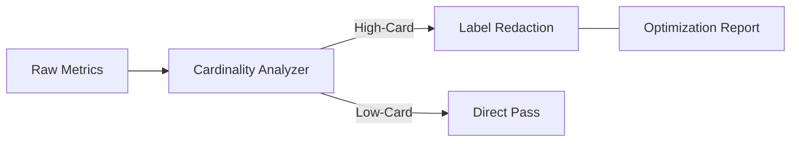

### 5. Multi-Tier Storage Architecture (Hot/Warm/Cold)
Tiering observability data based on access frequency, moving historical data from expensive SSDs to low-cost object storage and long-term archives.

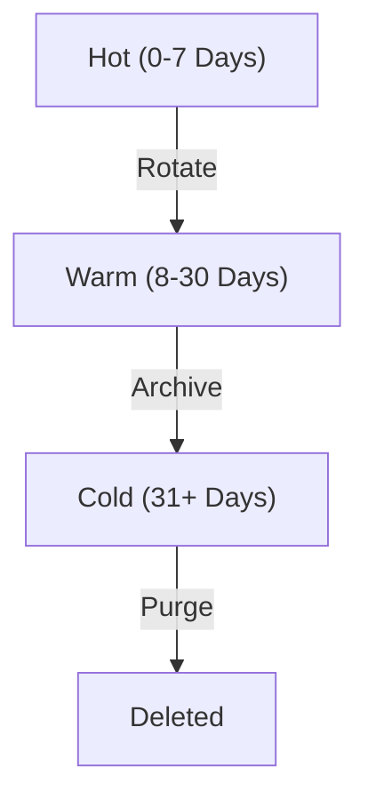

### 6. Trace Tail-Based Sampling Strategy
Retaining 100% of error traces and high-latency spans while sampling only a small fraction of successful requests, maximizing forensic value per byte stored.

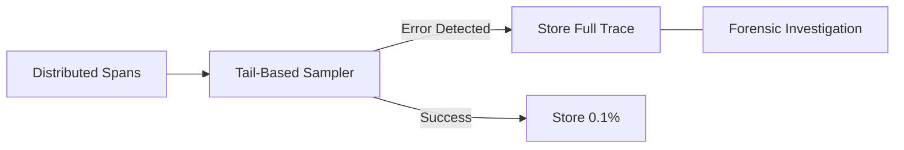

### 7. Institutional Telemetry Cost Scorecard
Grading organizational performance based on key indicators: Signal-to-Noise Ratio, Storage Efficiency, and Observability Spend-to-Revenue.

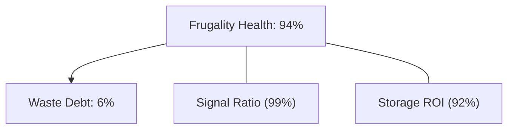

### 8. Identity & RBAC for Monitoring Governance
Managing fine-grained access to sampling rates, retention policies, and cost dashboards between SREs, FinOps Analysts, and Developers.

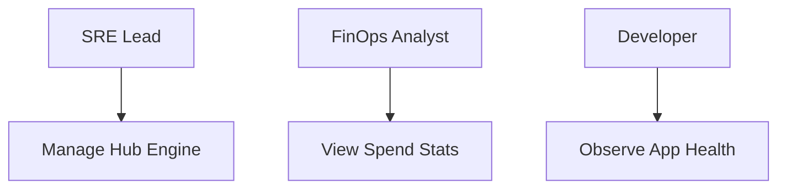

### 9. IaC Deployment: Frugality-as-Code Framework
Using modular Terraform to deploy and manage the versioned distribution of the frugality hubs, sampling workers, and forensic metadata lakes.

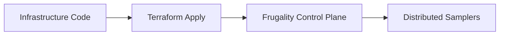

### 10. AIOps Signal Quality Validation Flow
Using advanced analytics to identify "Zombie Metrics" (metrics being sent but never queried) and unread dashboards, triggering automated cleanup recommendations.

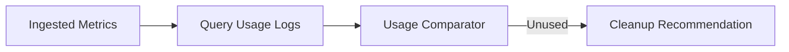

### 11. Metadata Lake for Forensic Telemetry Audit
Storing long-term records of every signal dropped, every sampling decision, and every dollar saved for institutional record-keeping and compliance auditing.

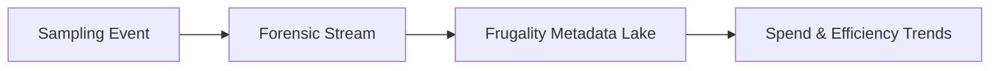

---

## 🏛️ Core Frugality Pillars

1.  **High-Precision Tail Sampling**: Maximizing forensic value by selectively retaining high-interest telemetry spans.
2.  **Automated Cardinality Governance**: Preventing exponential storage growth through real-time label optimization.
3.  **Multi-Tier Lifecycle Management**: Minimizing storage unit costs through automated data aging.
4.  **Signal-to-Noise Intelligence**: Identifying and eliminating "zombie" telemetry that provides zero operational value.
5.  **Budget-Aware Ingestion Control**: Enforcing hard-fences on telemetry spending at the ingestion point.
6.  **Full Telemetry Auditability**: Immutable recording of every sampling and retention decision for institutional forensics.

---

## 🛠️ Technical Stack & Implementation

### Frugality Engine & APIs
*   **Framework**: Python 3.11+ / FastAPI.
*   **Data Hub**: OpenTelemetry Collector with custom frugality processors.
*   **Backend**: Prometheus (Metrics), Loki (Logs), Tempo (Traces).
*   **Persistence**: PostgreSQL (Metadata Lake) and Redis (Live Sampling Cache).
*   **Auth Orchestrator**: Federated OIDC/SAML for least-privilege telemetry management access.

### Frugality Dashboard (UI)
*   **Framework**: React 18 / Vite.
*   **Theme**: Dark, Amber, Slate (Modern high-fidelity FinOps aesthetic).
*   **Visualization**: Recharts for spend trends, cardinality heatmaps, and savings realization analytics.

### Infrastructure & DevOps
*   **Runtime**: AWS EKS or Azure Kubernetes Service (AKS).
*   **Storage Plane**: Tiered deployment across EBS (Hot), S3 (Warm), and Glacier (Cold).
*   **IaC**: Modular Terraform for deploying the frugality hub and sampler distributions.

---

## 🏗️ IaC Mapping (Module Structure)

| Module | Purpose | Real Services |
| :--- | :--- | :--- |
| **`infrastructure/frugal_hub`** | Central management plane | EKS, PostgreSQL, Redis |
| **`infrastructure/samplers`** | Distributed sampling fleet | OTEL Collector, Lambda |
| **`infrastructure/storage`** | Tiered data lifecycle | S3, EBS, Lifecycle Rules |
| **`infrastructure/auditing`** | Forensic telemetry sinks | S3, Athena, Quicksight |

---

## 🚀 Deployment Guide

### Local Principal Environment
```bash
# Clone the frugality platform
git clone https://github.com/devopstrio/monitoring-cost-frugal.git
cd monitoring-cost-frugal

# Configure environment
cp .env.example .env

# Launch the Frugality stack
make init

# Trigger a mock telemetry ingestion and sampling simulation
make simulate-frugality
```

Access the Frugal Hub at `http://localhost:3000`.

---

## 📜 License
Distributed under the MIT License. See `LICENSE` for more information.

---
<div align="center">
  <p>© 2026 Devopstrio. All rights reserved.</p>
</div>
