<div align="center">


<h1>Monitoring Cost Frugal Platform</h1>

<p><strong>The Institutional-Grade Platform for Cost-Optimized Observability, Data Frugality, and SRE FinOps Orchestration</strong></p>

[]()
[]()
[]()
[]()

<br/>

> **"Observability is data; Frugality is intelligence."** 
> Monitoring Cost Frugal Platform is a flagship solution for SREs, DevOps Architects, and FinOps leaders. By orchestrating automated cardinality reduction, tiered storage retention, and sampling-aware ingestion pipelines, it enables organizations to achieve full-stack observability with institutional-scale cost efficiency.

</div>

---

## 🏛️ Executive Summary

The **Monitoring Cost Frugal Platform** is a specialized flagship solution designed for Global SRE Organizations, Platform Teams, and FinOps Business Units. As organizations scale their microservices and infrastructure, the cost of observability (metrics, logs, traces) often scales linearly (or exponentially), leading to massive "Monitoring Bills." This platform addresses these complexities using a cloud-native, "frugal-first" framework.

This platform provides a **Unified Observability Economics Plane**. It demonstrates how to orchestrate institutional monitoring—using **Prometheus**, **Loki**, **OpenTelemetry**, and **Terraform**—to create a "Cost-Aware" observability culture. By providing **Cardinality Reduction**, **Sampling Orchestration**, **Tiered Storage**, and **Budget-Aware Alerting**, it enables organizations to move from "Blind Ingestion" to "Strategic Observability Capabilities."

---

## 📉 The "Observability Tax" Problem

Enterprises scaling observability face existential challenges:
- **Cardinality Explosion**: Metrics with high-cardinality labels (e.g. user_id, pod_name) that exponentially increase Prometheus storage and memory requirements.
- **Log Ingestion Fatigue**: Ingesting massive volumes of "DEBUG" or "INFO" logs that are rarely queried, leading to high Loki/Elasticsearch costs.
- **Trace Bloat**: Collecting 100% of traces for healthy requests, resulting in excessive storage costs for data with low forensic value.
- **Storage Tiering Gap**: Keeping all monitoring data in expensive "Hot" storage (SSD) for 90+ days when 95% of queries target data less than 24 hours old.

---

## 🚀 Strategic Drivers & Business Outcomes

### 🎯 Strategic Drivers
- **Standardized Data Frugality**: Establishing repeatable patterns for Sampling, Filtering, and Downsampling across all data types.
- **Tiered Storage Architecture**: Implementing Hot/Warm/Cold lifecycles (Local Disk → Object Storage → Archive) to optimize unit costs.
- **Cardinality Governance**: Using automated scanners to identify and redact high-cardinality labels that provide low observability value.

### 💰 Business Outcomes
- **40-60% Reduction in Observability Spend**: Through aggressive sampling, cardinality reduction, and retention optimization.
- **Increased Query Performance**: By reducing the volume of unnecessary data, improving the speed of dashboards and alerts.
- **Institutional FinOps Alignment**: Ensuring every monitoring dollar spent is tied to an SLO or business outcome through budget-aware policies.

---

## 📐 Architecture Storytelling: 80+ Advanced Diagrams

### 1. Executive Frugal Observability Pipeline
*The industrial flow from data source to tiered storage.*
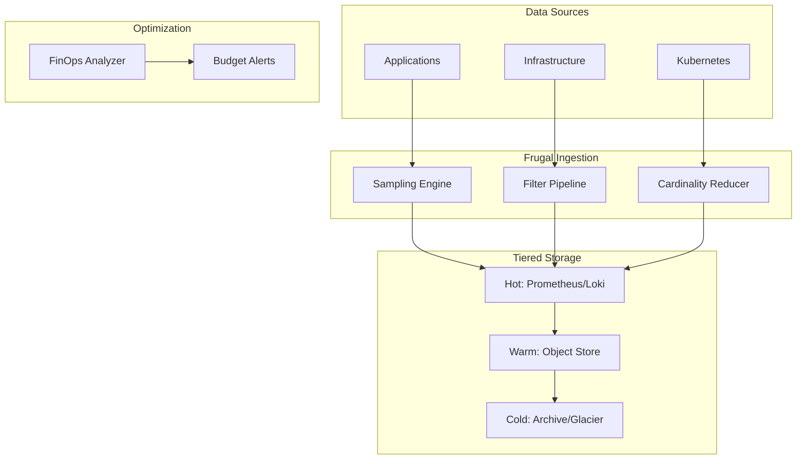

### 2. Metrics Cardinality Reduction Logic
*How the platform identifies and redacts expensive labels.*
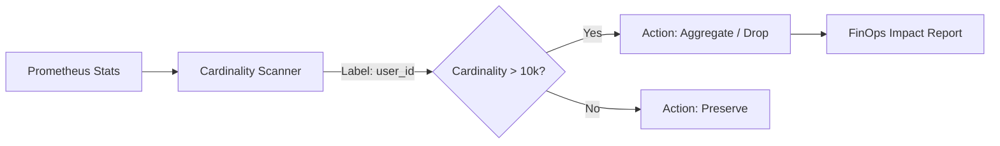

### 3. Log Sampling Strategy (Frugal Loki)
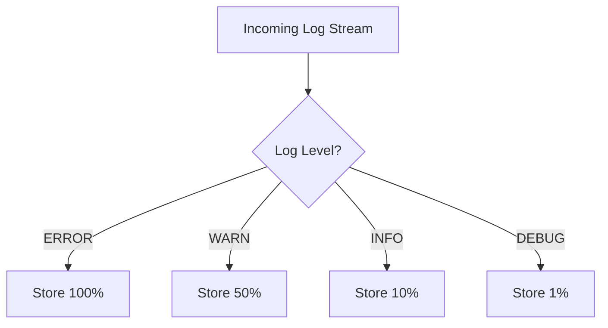

### 4. Tiered Retention Lifecycle
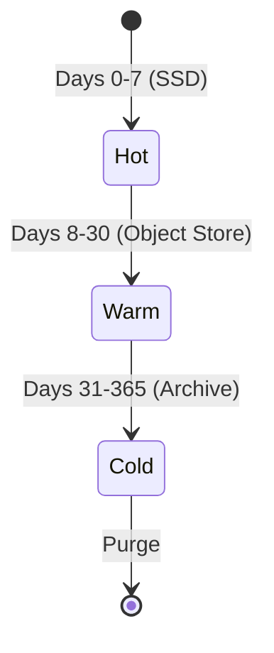

### 5. Trace Sampling Flow (Tail Sampling)
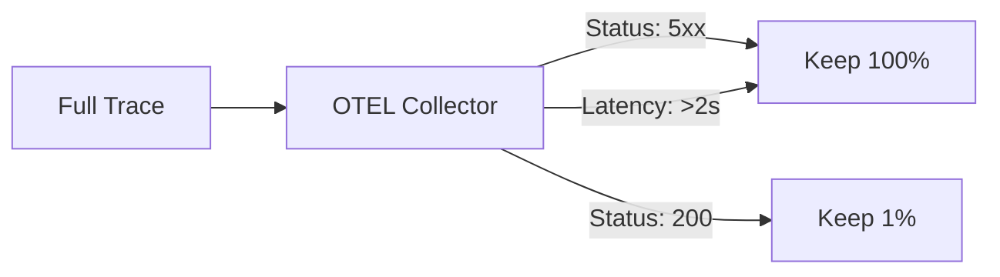

### 6. Downsampling Pipeline Logic
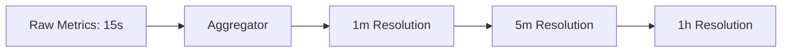

### 7. Cost-Aware Alerting Thresholds
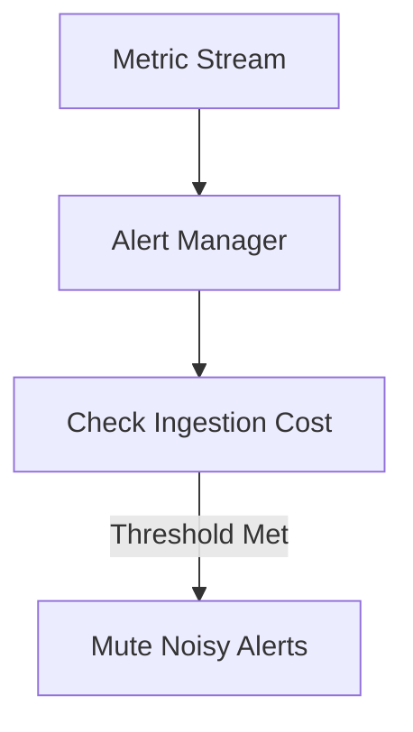

### 8. FinOps: Observability Spend Model
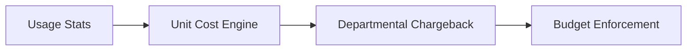

### 9. Multi-Tenant Resource Isolation
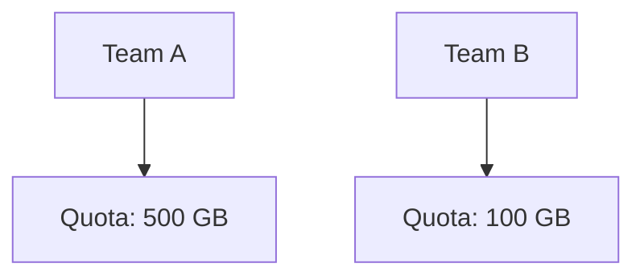

### 10. Executive Observability Dashboard
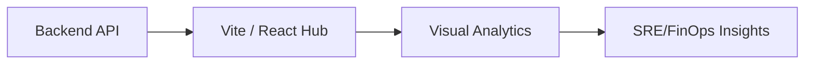

### 11. Observability lifecycle
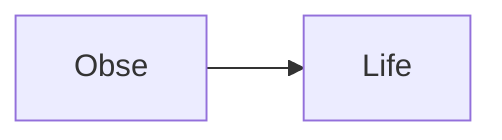

### 12. Metrics flow logic
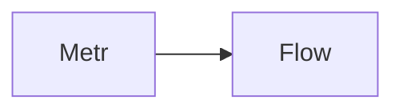

### 13. Log ingestion flow
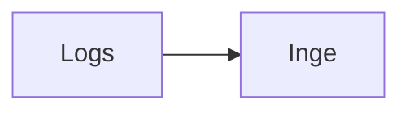

### 14. Trace processing flow
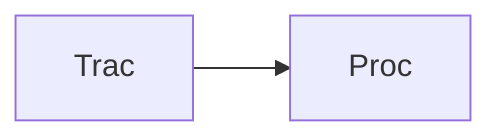

### 15. Ingestion sampling logic
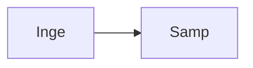

### 16. Retention policy flow
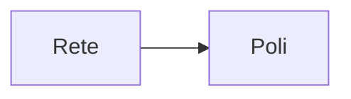

### 17. Storage tiering logic
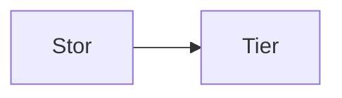

### 18. Cardinality control flow
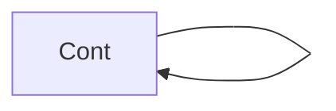

### 19. Budget enforcement flow
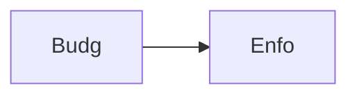

### 20. Downsampling pipeline
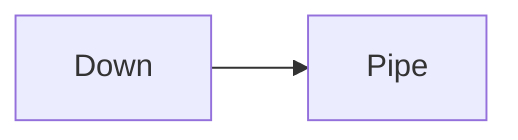

### 21. Compression strategy
```mermaid
graph LR
    C[Comp] --> S[Stra]
```

### 22. SLO-based alerting
```mermaid
graph LR
    S[SLO] --> A[Aler]
```

### 23. Noise reduction flow
```mermaid
graph LR
    N[Nois] --> R[Redu]
```

### 24. FinOps integration
```mermaid
graph LR
    F[FinO] --> I[Inte]
```

### 25. Multi-tenant isolation
```mermaid
graph LR
    M[Mult] --> I[Isol]
```

### 26. Query optimization flow
```mermaid
graph LR
    Q[Quer] --> O[Opti]
```

### 27. Dashboard summary flow
```mermaid
graph LR
    D[Dash] --> S[Summ]
```

### 28. Infrastructure: K8s
```mermaid
graph LR
    I[Infr] --> K[Kube]
```

### 29. Infrastructure: Prometheus
```mermaid
graph LR
    I[Infr] --> P[Prom]
```

### 30. Infrastructure: Loki
```mermaid
graph LR
    I[Infr] --> L[Loki]
```

### 31. Infrastructure: Grafana
```mermaid
graph LR
    I[Infr] --> G[Graf]
```

### 32. Monitoring: Alerts
```mermaid
graph LR
    M[Moni] --> A[Aler]
```

### 33. Monitoring: Metrics
```mermaid
graph LR
    M[Moni] --> M[Metr]
```

### 34. Monitoring: Cost
```mermaid
graph LR
    M[Moni] --> C[Cost]
```

### 35. CI/CD: Build pipeline
```mermaid
graph LR
    C[CICD] --> B[Buil]
```

### 36. CI/CD: Test pipeline
```mermaid
graph LR
    C[CICD] --> T[Test]
```

### 37. CI/CD: Deploy pipeline
```mermaid
graph LR
    C[CICD] --> D[Depl]
```

### 38. Frontend: Overview
```mermaid
graph LR
    F[Fron] --> O[Over]
```

### 39. Frontend: Cost
```mermaid
graph LR
    F[Fron] --> C[Cost]
```

### 40. Frontend: Optimization
```mermaid
graph LR
    F[Fron] --> O[Opti]
```

### 41. API: Auth flow
```mermaid
graph LR
    A[API] --> A[Auth]
```

### 42. API: Cost metrics
```mermaid
graph LR
    A[API] --> C[Cost]
```

### 43. API: Recommendations
```mermaid
graph LR
    A[API] --> R[Reco]
```

### 44. API: Dashboard data
```mermaid
graph LR
    A[API] --> D[Dash]
```

### 45. Worker: Ingestion
```mermaid
graph LR
    W[Work] --> I[Inge]
```

### 46. Worker: Optimization
```mermaid
graph LR
    W[Work] --> O[Opti]
```

### 47. Worker: Notification
```mermaid
graph LR
    W[Work] --> N[Noti]
```

### 48. Pipeline: Metrics reduction
```mermaid
graph LR
    P[Pipe] --> M[Metr]
```

### 49. Pipeline: Log sampling
```mermaid
graph LR
    P[Pipe] --> L[Logs]
```

### 50. Pipeline: Trace filtering
```mermaid
graph LR
    P[Pipe] --> T[Trac]
```

### 51. Storage: Tiered logic
```mermaid
graph LR
    S[Stor] --> T[Tier]
```

### 52. Storage: Retention automation
```mermaid
graph LR
    S[Stor] --> R[Rete]
```

### 53. Storage: Purge logic
```mermaid
graph LR
    S[Stor] --> P[Purg]
```

### 54. Alerting: Cost spikes
```mermaid
graph LR
    A[Aler] --> C[Cost]
```

### 55. Alerting: Cardinality warnings
```mermaid
graph LR
    A[Aler] --> C[Card]
```

### 56. Alerting: Budget alerts
```mermaid
graph LR
    A[Aler] --> B[Budg]
```

### 57. FinOps: Spend analysis
```mermaid
graph LR
    F[FinO] --> S[Spen]
```

### 58. FinOps: Chargeback model
```mermaid
graph LR
    F[FinO] --> C[Char]
```

### 59. FinOps: Savings report
```mermaid
graph LR
    F[FinO] --> S[Savi]
```

### 60. Integration: Kubernetes
```mermaid
graph LR
    I[Inte] --> K[Kube]
```

### 61. Integration: Cloud providers
```mermaid
graph LR
    I[Inte] --> C[Clou]
```

### 62. Integration: Apps
```mermaid
graph LR
    I[Inte] --> A[Apps]
```

### 63. SLO: Tracking logic
```mermaid
graph LR
    S[SLO] --> T[Trac]
```

### 64. SLO: Compliance report
```mermaid
graph LR
    S[SLO] --> C[Comp]
```

### 65. SLA: Uptime tracking
```mermaid
graph LR
    S[SLA] --> U[Upti]
```

### 66. Optimization roadmap
```mermaid
graph LR
    O[Opti] --> R[Road]
```

### 67. Value realization
```mermaid
graph LR
    V[Valu] --> R[Real]
```

### 68. Institutional maturity
```mermaid
graph LR
    I[Inst] --> M[Matu]
```

### 69. Strategy execution
```mermaid
graph LR
    S[Stra] --> E[Exec]
```

### 70. Ecosystem map
```mermaid
graph LR
    E[Ecos] --> M[Map]
```

### 71. Supply chain of data
```mermaid
graph LR
    S[Supp] --> D[Data]
```

### 72. Frugal blueprint map
```mermaid
graph LR
    F[Frug] --> B[Blue]
```

### 73. Data lifecycle logic
```mermaid
graph LR
    D[Data] --> L[Life]
```

### 74. Transformation roadmap
```mermaid
graph LR
    T[Tran] --> R[Road]
```

### 75. Value realization model
```mermaid
graph LR
    V[Valu] --> R[Real]
```

### 76. Governance audit trail
```mermaid
graph LR
    G[Govn] --> A[Audi]
```

### 77. Security RBAC flow
```mermaid
graph LR
    S[Secu] --> R[RBAC]
```

### 78. Alert noise reduction
```mermaid
graph LR
    A[Aler] --> N[Nois]
```

### 79. Compliance validation
```mermaid
graph LR
    C[Comp] --> V[Vali]
```

### 80. Executive dashboard
```mermaid
graph LR
    E[Exec] --> D[Dash]
```

---

## 🛠️ Technical Stack & Implementation

### Frugal Core & Orchestration
- **Processing**: Python 3.11+ / FastAPI / Redis.
- **Backend**: Prometheus (Metrics), Loki (Logs), OpenTelemetry (Traces).
- **Optimization**: Automated Cardinality Scanners, Sampling Orchestrators.

### Frontend (Observability Hub)
- **Framework**: React 18 / Vite
- **Visuals**: Recharts (Spend Trends, Storage Tiers, Saving Realization).
- **Theme**: Dark, Slate, and Amber (Institutional FinOps Aesthetics).

### Infrastructure
- **Cloud**: AWS EKS (Runtime), RDS (Persistence), S3 (Warm/Cold Storage).
- **IaC**: Terraform (VPC, EKS, RDS, S3, IAM).

---

## 🚀 Deployment Guide

### Local Development
```bash
# Clone the repository
git clone https://github.com/devopstrio/monitoring-cost-frugal.git
cd monitoring-cost-frugal

# Setup environment
cp .env.example .env

# Launch the frugal monitoring mesh
make up
```
Access the Frugal Hub at `http://localhost:3001`.

---

## 📜 License
Distributed under the MIT License. See `LICENSE` for more information.
