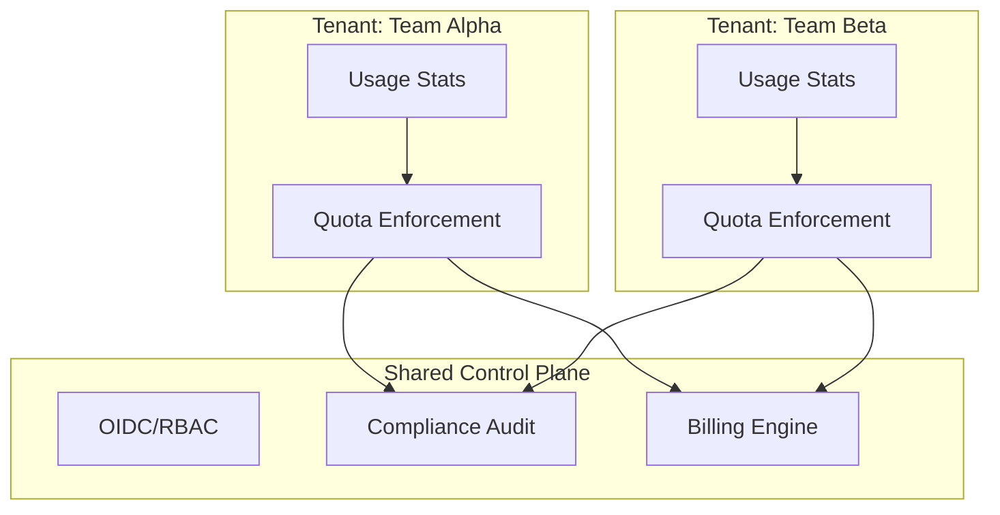
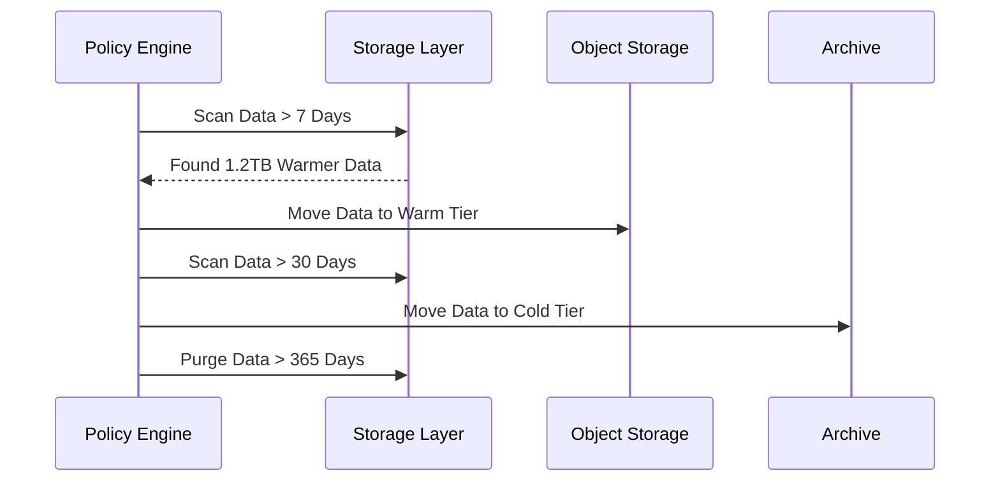
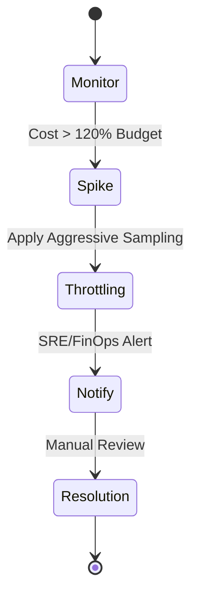

# Architecture & Governance Diagrams

## 31. Multi-tenant isolation architecture

```mermaid
graph TD
    subgraph "Tenant: Team Alpha"
        UsageA[Usage Stats] --> QuotaA[Quota Enforcement]
    end
    subgraph "Tenant: Team Beta"
        UsageB[Usage Stats] --> QuotaB[Quota Enforcement]
    end
    subgraph "Shared Control Plane"
        Auth[OIDC/RBAC]
        Audit[Compliance Audit]
        Bill[Billing Engine]
    end

    QuotaA --> Bill
    QuotaB --> Bill
    QuotaA --> Audit
    QuotaB --> Audit
```

## 40. Automated Retention Policy Flow

```mermaid
sequenceDiagram
    participant Pol as Policy Engine
    participant Sto as Storage Layer
    participant S3 as Object Storage
    participant Arc as Archive

    Pol->>Sto: Scan Data > 7 Days
    Sto-->>Pol: Found 1.2TB Warmer Data
    Pol->>S3: Move Data to Warm Tier
    Pol->>Sto: Scan Data > 30 Days
    Pol->>Arc: Move Data to Cold Tier
    Pol->>Sto: Purge Data > 365 Days
```

## 50. Budget-Aware Alerting State Machine

```mermaid
stateDiagram-v2
    [*] --> Monitor
    Monitor --> Spike: Cost > 120% Budget
    Spike --> Throttling: Apply Aggressive Sampling
    Throttling --> Notify: SRE/FinOps Alert
    Notify --> Resolution: Manual Review
    Resolution --> [*]
```
