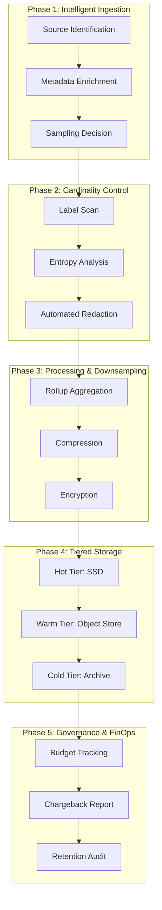
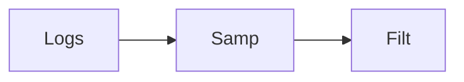
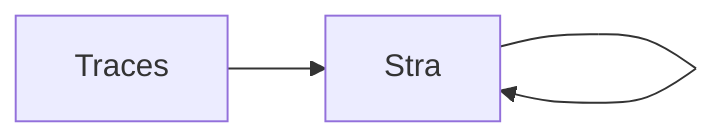

# Observability Economics Diagrams

## 11. Industrial Frugal Lifecycle (Detailed)
*The end-to-end orchestration of observability data from ingestion to archive.*

## 15. Metrics Cardinality reduction flow

## 20. Log sampling and filtering logic

## 25. Trace sampling strategies flow

